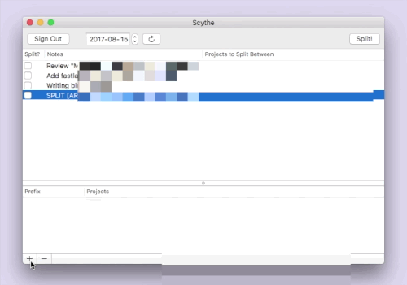

# Scythe

Scythe cuts your Harvest ⛏

Some client projects require splitting time across more than one Harvest project, so there's a need for a tool that can automate this. Other tools like Trello that can link to Harvest timers need to keep that association when a timer is split.

Scythe makes this easy by letting you specify prefixes that you add to your timer notes that determine how you want a particular timer to be split. For example, by creating a "split" with the prefix "2017" and the projects "Client A - Part A" and "Client A - Part B", any timers that start with the string "2017 " (note the space) will be split among those two projects. The new, split timers will have that prefix removed.

## Installation

[Download the latest version](https://github.com/RobotsAndPencils/Scythe/releases/latest)

## Contact

Follow Robots & Pencils on Twitter ([@robotsNpencils](https://twitter.com/robotsNpencils))

## Maintainers

- [Brandon Evans](https://github.com/interstateone)

## License

Scythe is available under the MIT license. See the LICENSE file for more info.

